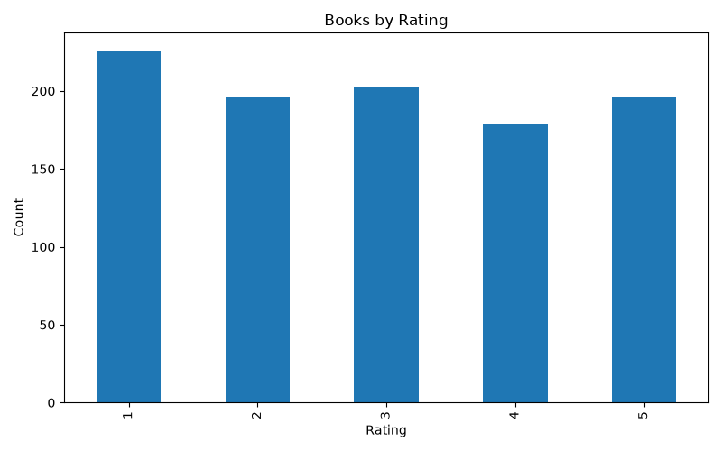
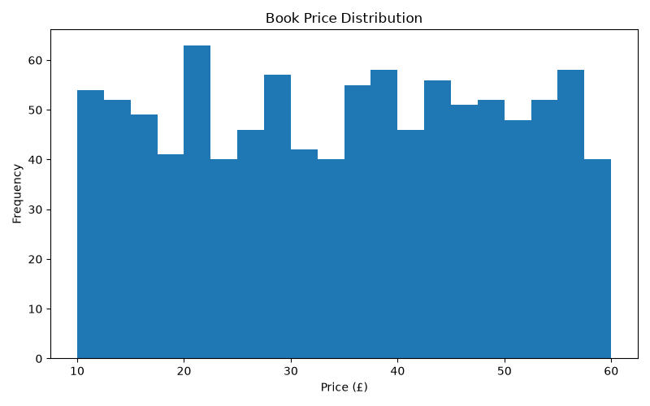
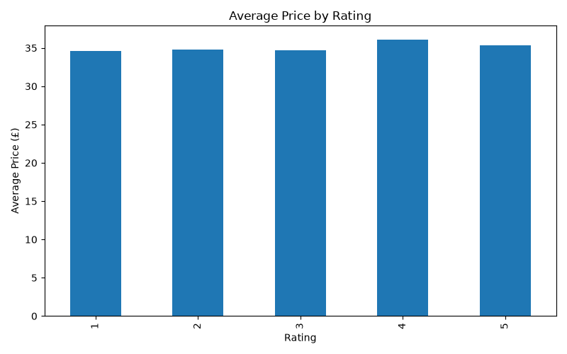
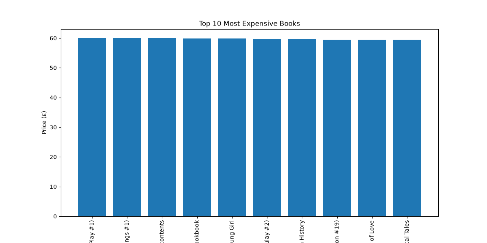
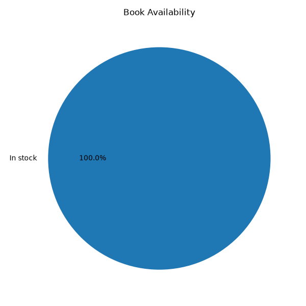

# CodeAlpha Web Scraping and Data Analytics Project

## Overview

This project was developed as part of the **CodeAlpha Data Analytics Internship**. The objective is to collect book information from the **Books to Scrape** website using Python, clean and preprocess the collected data, perform exploratory data analysis (EDA), and generate meaningful visualizations.


## Objectives

- Scrape book information from a website.
- Store the collected data in CSV format.
- Clean and preprocess the dataset.
- Perform exploratory data analysis.
- Generate visualizations for better insights.
- Save the processed dataset for future analysis.


## Website Used

Books to Scrape

https://books.toscrape.com/


## Technologies Used

- Python
- Requests
- BeautifulSoup4
- Pandas
- Matplotlib
- Git
- GitHub
- Visual Studio Code


## Project Structure

CodeAlpha_WebScraping_Project
│
├── dataset
│   ├── books.csv
│   └── clean_books.csv
│
├── images
│   ├── average_price_rating.png
│   ├── book_availability.png
│   ├── books_by_rating.png
│   ├── price_distribution.png
│   └── top10_expensive_books.png
│
├── src
│   ├── scraper.py
│   ├── preprocessing.py
│   ├── analysis.py
│   └── visualization.py
│
├── main.py
├── requirements.txt
└── README.md

## Features

- Web scraping using BeautifulSoup
- Data cleaning and preprocessing
- Missing value detection
- Duplicate removal
- Price conversion to numeric format
- Exploratory Data Analysis (EDA)
- Data visualization using Matplotlib
- Export of cleaned dataset to CSV format


## Dataset

The dataset includes the following information:

- Book Title
- Price
- Availability
- Rating


## Data Analysis

The project performs:

- Dataset inspection
- Missing value analysis
- Duplicate record detection
- Price data cleaning
- Statistical summary
- Rating analysis


## Visualizations

The following visualizations are generated automatically:

- Books by Rating
- Price Distribution
- Average Price by Rating
- Top 10 Most Expensive Books
- Book Availability Distribution

All charts are saved in the **images** folder.

## Sample Visualizations

### Books by Rating



### Price Distribution



### Average Price by Rating



### Top 10 Most Expensive Books



### Book Availability Distribution




## Installation

Clone the repository:

```bash
git clone https://github.com/LisikaKarunakaran/CodeAlpha_WebScraping_Project.git
```

Navigate to the project directory:

```bash
cd CodeAlpha_WebScraping_Project
```

Install the required dependencies:

```bash
pip install -r requirements.txt
```


## Usage

Run the complete project using:

```bash
python main.py
```

The project will automatically:

- Scrape book data
- Save the dataset
- Clean the dataset
- Perform data analysis
- Generate visualization charts


## Output

The project generates:

- books.csv
- clean_books.csv
- Data analysis results
- Visualization charts stored in the images folder


## Future Enhancements

- Scrape multiple pages and categories
- Export data to Excel format
- Store data in a SQL database
- Develop an interactive Streamlit dashboard
- Add interactive visualizations using Plotly


## Author

**Lisika Karunakaran**

B.Tech – Artificial Intelligence and Data Science

GitHub:
https://github.com/LisikaKarunakaran

LinkedIn:
https://www.linkedin.com/in/lisika-k-3828902a4


## Acknowledgement

This project was completed as part of the **CodeAlpha Data Analytics Internship**. It demonstrates practical skills in web scraping, data preprocessing, exploratory data analysis, and data visualization using Python.
